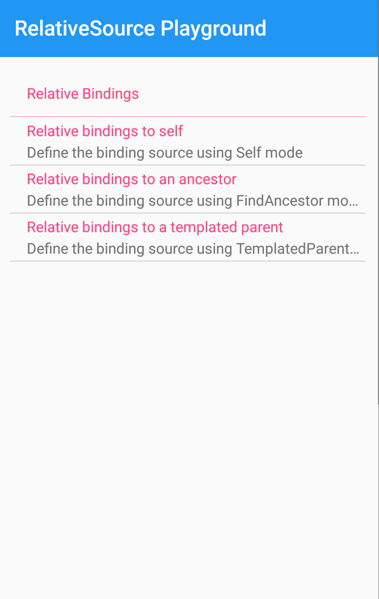
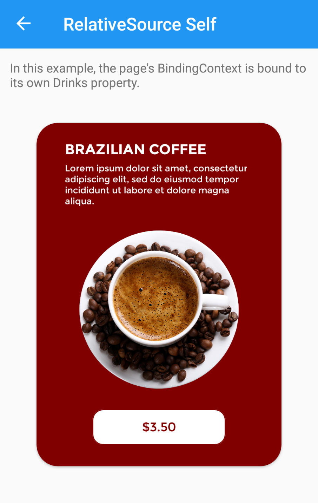
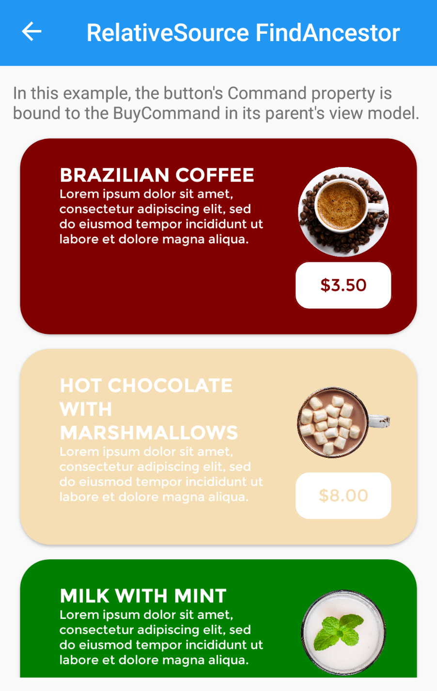
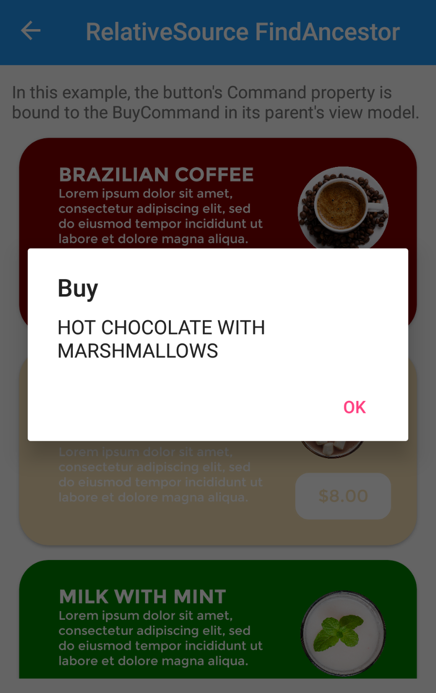
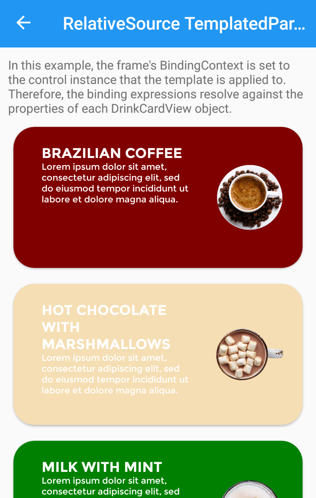

# RelativeSourcePlayground

Xamarin.Forms sample associated with a official blog to explain the use of **RelativeSource**.

## Screenshots

     

## Copyright and license

Code released under the [MIT license](https://opensource.org/licenses/MIT).